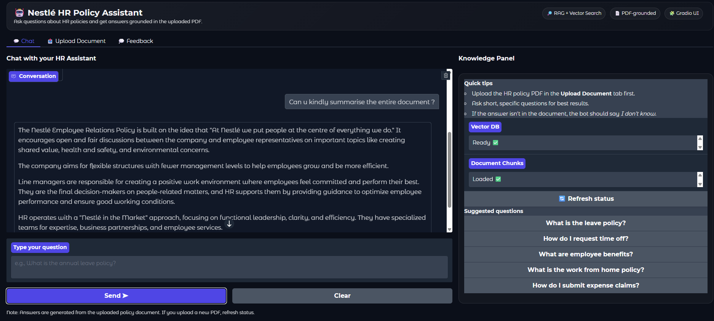
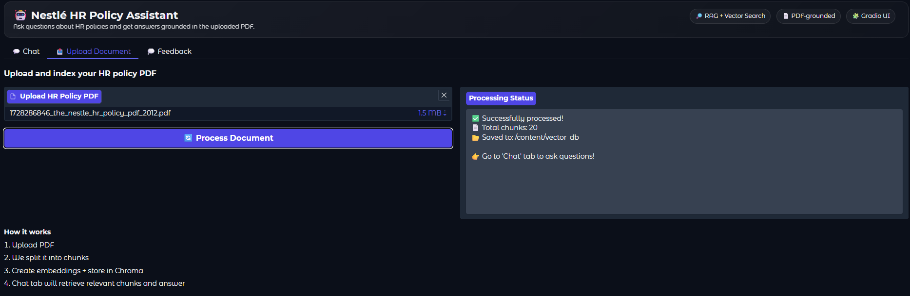
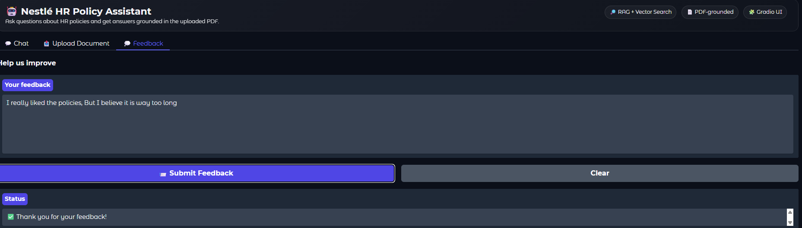

# UI Walkthrough

## 1. Chat Assistant
- Ask questions based on the uploaded HR policy
- Responses grounded in RAG pipeline

## 2. Upload Document
- Upload PDF → rebuilds vector store
- Shows confirmation

## 3. Feedback Tab
- Submit feedback on answers
- Logs stored locally for review

